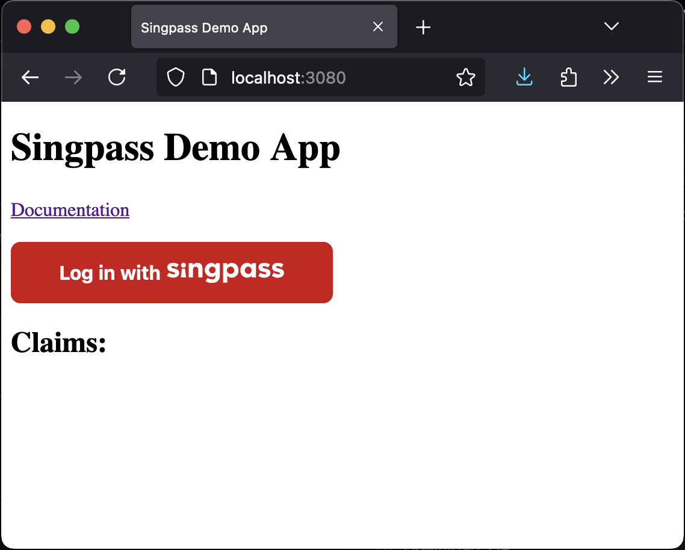
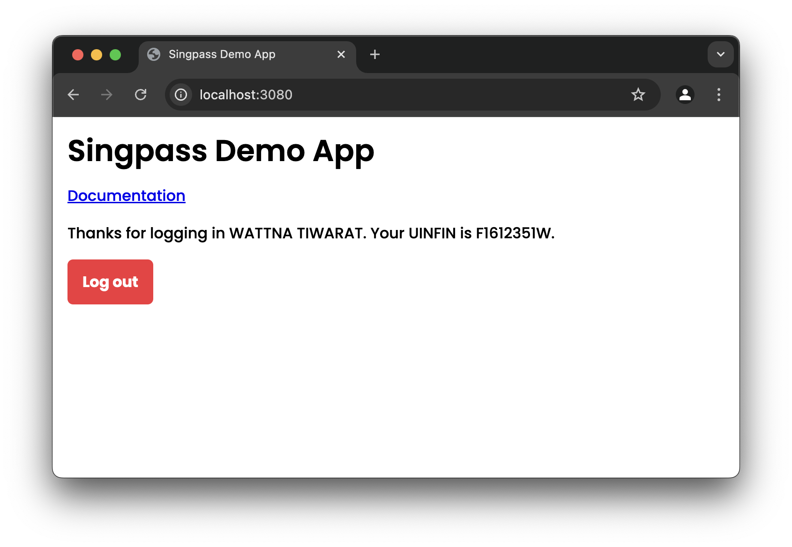

# Demo App

This repository provides examples of how you might integrate with Singpass (an OIDC provider) as an OIDC client.

## Running the Demo App Locally

To run the demo app for your preferred language locally, please refer to the instructions below.

### NodeJS

Install [NodeJS and npm](https://docs.npmjs.com/downloading-and-installing-node-js-and-npm) and run:

```shell
cd examples/nodejs
npm install
npm start
```

### Java

Install [JDK](https://docs.oracle.com/en/java/javase/17/install/overview-jdk-installation.html) and run:

```shell
cd examples/java
./gradlew bootRun
```

## Using the Demo App

Once your demo app is running, visit http://localhost:3080.



Click the "log in with Singpass" button. On the Singpass login page, select "password login". You may use the staging credentials below:

```
TODO
```

After successfully authenticating, you will be redirected to the demo app. If all went well, a UUID returned by the Singpass API will be shown.


