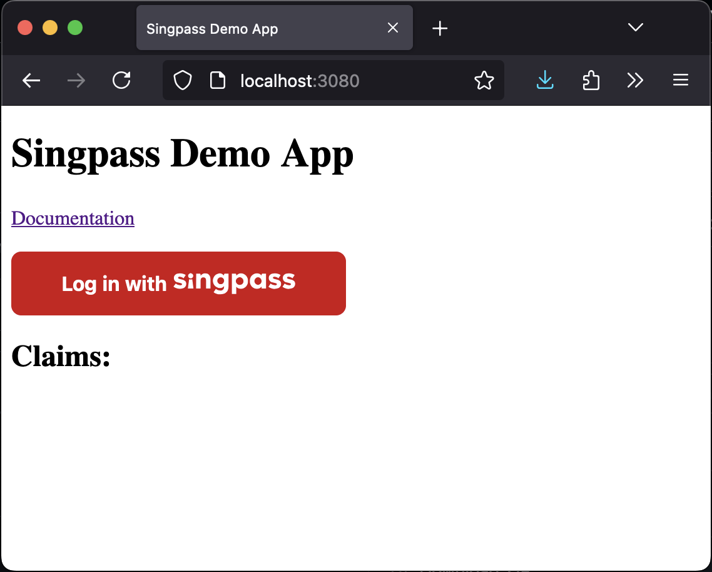
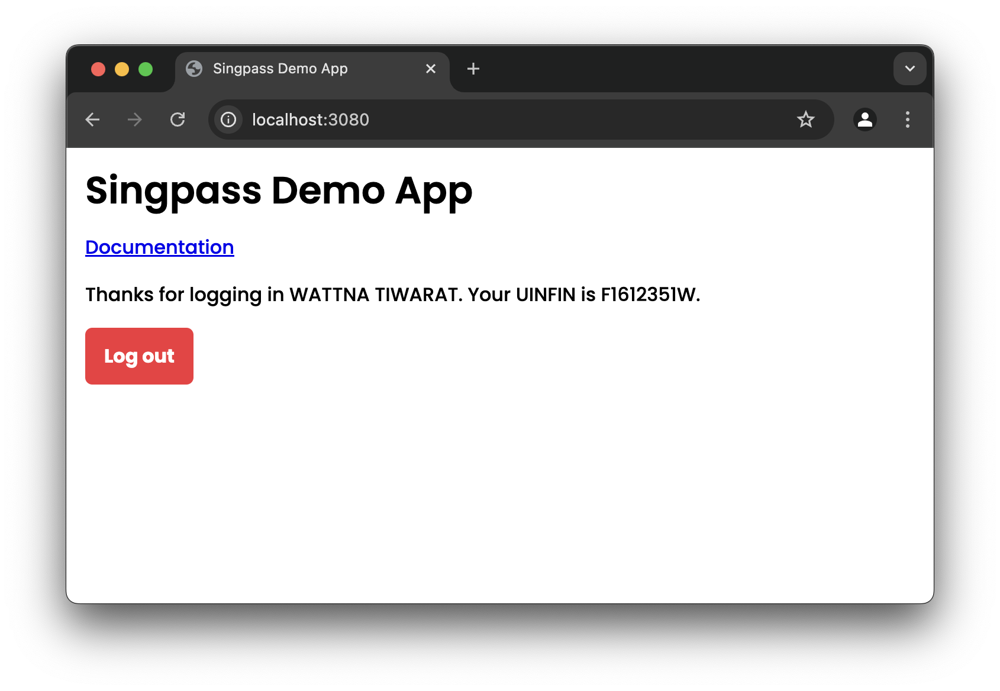

# Demo App

This repository provides examples of how you might integrate with Singpass (an OIDC provider) as an OIDC client.

Currently, we have examples using NodeJS and Java.

## Running the Demo App Locally

To run the demo app for your preferred language locally, please refer to the instructions below.

### NodeJS

Install [NodeJS and npm](https://docs.npmjs.com/downloading-and-installing-node-js-and-npm) and run:

```shell
cd examples/nodejs
npm install
npm start
```

### Java

This demo application supports any Java version from Java 17 or newer.
Once Java is installed, run:

```shell
cd examples/java
./gradlew clean build
./gradlew run
```

On Windows, use `gradlew.bat` instead of `gradlew`.

## Using the Demo App

Once your demo app is running, visit http://localhost:3080.



Click the "log in with Singpass" button. On the Singpass login page, select "password login".

You may use the [Myinfo test personas listed here](https://docs.developer.singpass.gov.sg/docs/testing/myinfo-test-personas).

After successfully authenticating, you will be redirected to the demo app. If all went well, a UUID returned by the Singpass API will be shown.


